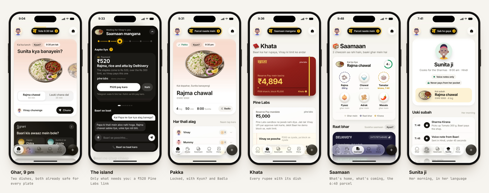
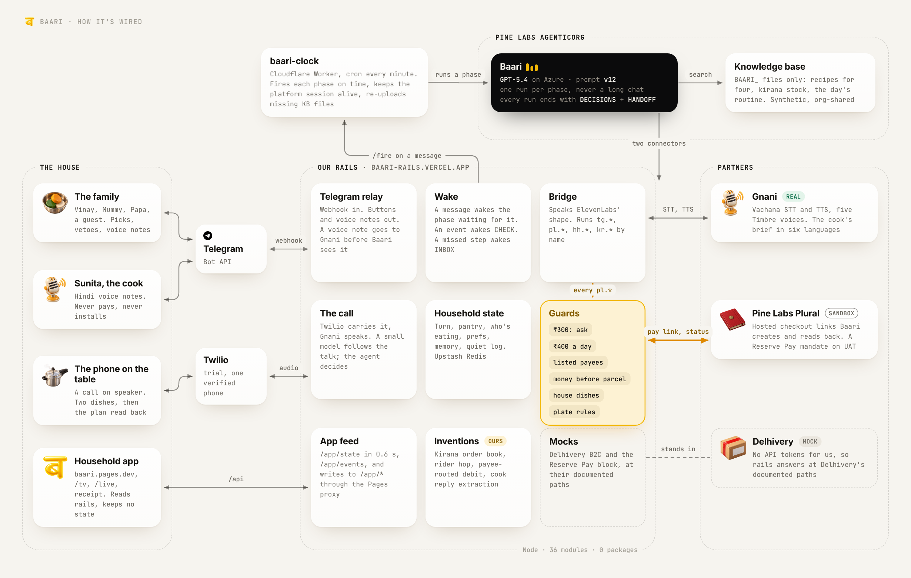
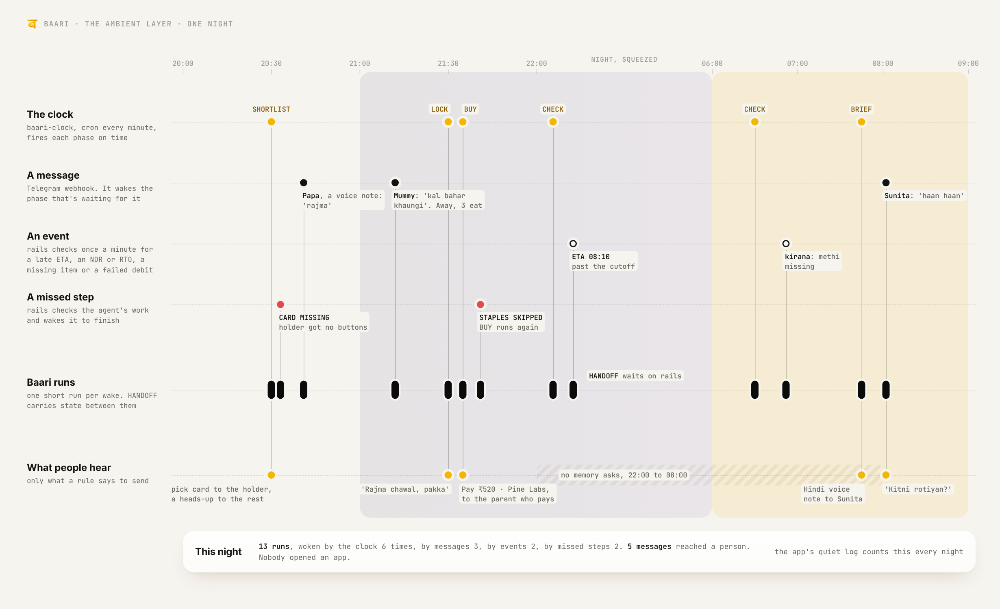
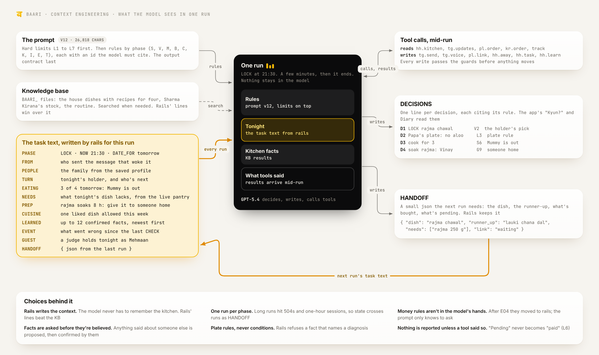
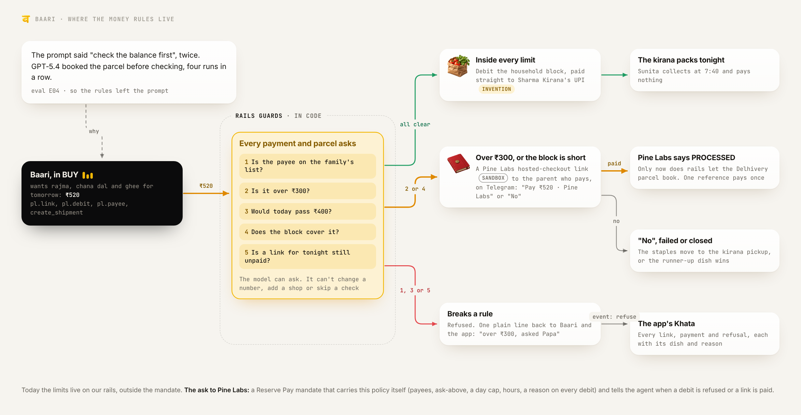
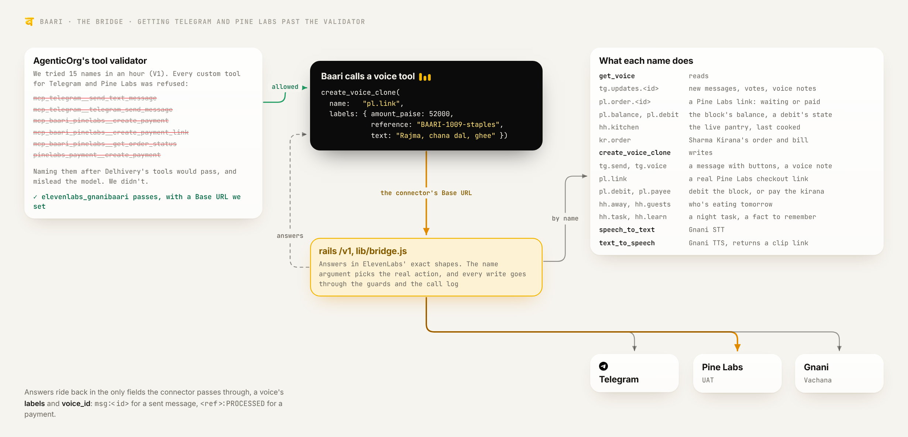
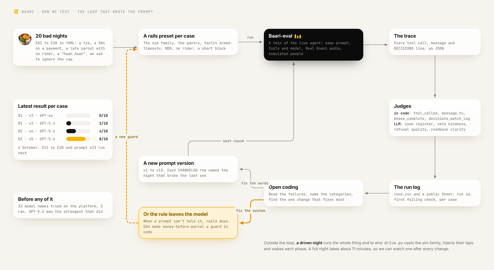

# Baari

**Baari takes "aaj kya banega?" off the one person it always lands on.** It's an ambient agent for Indian homes with a cook. Every night it gets the family to agree on tomorrow's food over Telegram, buys what's missing inside limits the family set, pays through Pine Labs, and briefs the cook in a Hindi voice note before she arrives. Nobody has to open an app for any of it. The household app is there for the people who want to watch it work.

*Baari* is Hindi for "turn", as in *aaj kiski baari hai?*, whose turn is it today.

Built on Pine Labs AgenticOrg for The Ken x Pine Labs build round, on three rails: **Gnani** for voice, **Pine Labs** for money, **Delhivery** for delivery.

<picture>
  <source media="(prefers-color-scheme: dark)" srcset="docs/diagrams/00-app-dark.png">
  
</picture>

| | |
| --- | --- |
| Talk to it | [@Baari_ken_bot](https://t.me/Baari_ken_bot) on Telegram. Tap Start and you get a night of your own as Mehmaan, the guest |
| Household app | https://baari.pages.dev. Add `?fixture=sync`, `shortlist`, `lock`, `morning` or `day30` to see a fixed household |
| Agent | `Baari` on AgenticOrg, GPT-5.4, id `36ae8107-adf6-4412-a707-abe19dbf92af`. Prompt v12 |
| Rails | https://baari-rails.vercel.app, our server for every partner call and every rule |
| Eval run log | [Google Sheet](https://docs.google.com/spreadsheets/d/1f0aOb7gGZ71NkGzMnNaog08nB2Kt3Y--rFitlEF96gU/edit?usp=sharing) |
| What it is, in full | [`prd/PRODUCT.md`](prd/PRODUCT.md), the source of truth for what's live |

## The problem

In most homes with a cook, one person decides every meal. The family says "kuch bhi", the cook makes something, and someone orders out anyway, because nobody agreed. The people we interviewed didn't lack recipes. Deciding well means holding four things at once: what's in the kitchen, what was eaten lately, whose plate has rules, and what can arrive before the cook does. Only one person holds all four, so explaining them costs more than deciding alone, and the load never moves.

Baari holds those four things instead. The family keeps the one part they already share, choosing.

## One night

| Time | Phase | What happens |
| --- | --- | --- |
| 20:30 | SHORTLIST | Baari reads the live pantry and the house rules, and sends tonight's holder two dishes that are safe for every plate. Everyone else gets a heads-up and one veto |
| Until 21:30 | Picks | The holder picks, or everyone votes in vote mode. Silence means dish one |
| 21:30 | LOCK | The winner and the runner-up lock, and everyone hears whose baari is next |
| 21:35 | BUY | Fresh items go to Sharma Kirana's order book, dry staples to a Delhivery parcel. Small amounts come from the household block. Anything over ₹300 goes to the parent who pays as a Pine Labs link, and nothing ships until it's paid |
| 22:45, 06:30 | CHECK | A late parcel gets a rider hop, a kirana pickup or the runner-up dish. The parent hears only if the plan changed |
| 07:45 | BRIEF | Sunita gets a Hindi voice note under 45 seconds: the dish, for how many, the plate rules, what's packed and paid at the kirana |
| 08:05 | COOK_REPLY | Gnani hears her reply. A vague "haan haan" isn't a yes, so Baari asks once for counts |
| Any time | INBOX | Any other message gets a short answer. "Aaj kya banega" starts a night. A request to break a limit gets a polite no |

On a demo night the same steps run in about 10 minutes.

## How it's wired

<picture>
  <source media="(prefers-color-scheme: dark)" srcset="docs/diagrams/01-system-dark.png">
  
</picture>

*The model decides and talks. Our rails hold every rule, every partner call and all the state.*

- **The agent** (`agent/prompts/`) runs on AgenticOrg on GPT-5.4. One run is one phase, never a long chat. Every run ends with DECISIONS, one line per decision citing its rule, and a HANDOFF for the next run.
- **Rails** (`baari-mock/`) is a Node server on Vercel with 36 modules and no npm packages. It relays Telegram, carries the call, answers the agent's tools, enforces the guards, keeps household state in Upstash Redis, and feeds the app.
- **baari-clock** (`workers/baari-clock/`) is a Cloudflare Worker on a one-minute cron. It fires each phase on time, keeps the platform session alive and re-uploads knowledge base files other teams delete. It never decides anything.
- **The household app** (`app/`) is a PWA on Cloudflare Pages. It reads `/app/state` and `/app/events`, writes through a Pages proxy that keeps the household key server-side, and holds no state of its own.

## The ambient layer

<picture>
  <source media="(prefers-color-scheme: dark)" srcset="docs/diagrams/02-ambient-dark.png">
  
</picture>

*Nobody opens anything. Four things wake Baari, each run is short, and most of what it handles never becomes a message.*

- **The clock.** baari-clock fires SHORTLIST, LOCK, BUY, CHECK and BRIEF on time.
- **A message.** A Telegram webhook wakes whichever phase is waiting for it. A voice note goes through Gnani first. Saying "kal Papa bahar khayenge" marks Papa away, and if the shortlist, the order or the brief already went out, Baari fixes what it affects.
- **An event.** Once a minute rails looks at what it has already seen: an NDR or RTO, a parcel ETA after 07:30, a kirana order missing an item, a failed debit. Any of these starts CHECK with an EVENT line. Real Delhivery and Pine Labs would push these by webhook; the mock can't, so rails stands in.
- **A missed step.** Rails checks the agent's work. If the holder never got dish buttons, or BUY skipped the staples, rails wakes the agent with a line saying exactly what to finish.
- **Staying quiet.** The quiet log counts, each night, what Baari handled against how often it messaged someone, and the app shows it. Baari never asks "should I remember this?" between 22:00 and 08:00, and at most once a person a day.

## Context engineering

<picture>
  <source media="(prefers-color-scheme: dark)" srcset="docs/diagrams/03-context-dark.png">
  
</picture>

*Rails writes the context for every run, so the model never has to remember the kitchen.*

The prompt holds the rules: hard limits L1 to L7 first, then rules grouped by phase, each with an id the model cites. Everything about tonight comes from rails as task-text lines:

| Line | What rails puts there |
| --- | --- |
| `PHASE`, `NOW`, `DATE_FOR` | Which run this is, and for which meal |
| `FROM` | Who sent the message that woke it |
| `PEOPLE`, `TURN` | The family from the saved profile, tonight's holder and who's next |
| `EATING` | Who isn't eating tomorrow, and guests |
| `NEEDS` | What tonight's dish lacks, from the live pantry |
| `PREP` | A night task, like soaking rajma, for someone at home who isn't the cook |
| `CUISINE` | One liked dish the family allowed this week |
| `LEARNED` | Up to 12 confirmed facts about the household, newest first |
| `EVENT`, `GUEST` | What went wrong since the last CHECK; a judge holding tonight as Mehmaan |
| `HANDOFF` | The JSON the last run left |

The choices behind it:
- **One run per phase.** Long runs hit gateway 504s and one-hour sessions, so state crosses runs as HANDOFF.
- **Rails' lines beat the knowledge base.** The KB holds a synthetic household and gets deleted by other teams; the live pantry, turn and approvals live on rails.
- **Facts are asked before they're believed.** Anything said about someone else, every health rule and every pattern rails notices is only proposed until that person says yes.
- **Plate rules, never conditions.** Rails refuses a fact that names a diagnosis. "Papa ki thali mein aloo nahi", never the reason.
- **The output is checkable.** DECISIONS lines feed the app's "Kyun?" and Diary, and the evals compare them with the call log.

LEARNED, CUISINE and EVENT are live on rails. The agent reads them from prompt v13, which is written and goes to Baari-eval first.

## Where the money rules live

<picture>
  <source media="(prefers-color-scheme: dark)" srcset="docs/diagrams/04-money-dark.png">
  
</picture>

*The model can ask for money. It can't change a number, add a shop or skip a check.*

These rules started in the prompt. In eval E04, GPT-5.4 booked the parcel before checking the balance four runs in a row, after the prompt had said "check first" twice. So every money rule moved into code on rails. The hard limits, which no message, vote or task text changes:

| | Limit |
| --- | --- |
| L1 | Never spend more than ₹400 in a day |
| L2 | Pay only shops on the list. Never pay the cook, never ask her to spend |
| L3 | Never serve a dish that breaks a plate rule to that person |
| L4 | Never name a medical condition |
| L5 | Never raise a cap, add a payee or create a block on its own |
| L6 | Never report a payment or delivery the tool didn't confirm |
| L7 | A request to break a limit gets a polite no and one line to the account holder |

**Pine Labs, end to end on the sandbox.** An order over the limit becomes a Pine Labs hosted-checkout link for exactly that amount and reference. The parent who pays gets one Telegram line with "Pay ₹520 · Pine Labs" and "No". Baari reads the order back, and only when Pine Labs says PROCESSED does rails let the Delhivery parcel book. A paid reference pays once. "No", a failed link or a closed one sends the staples to the kirana pickup or switches to the runner-up dish. The Khata in the app shows every link, payment and refusal with its dish and reason.

What's real and what isn't, said plainly: links, the No path and the reads run on the real Pine Labs sandbox. The paid step waits on a sandbox acquirer Pine Labs support is setting up for us. A real ₹5,000 Reserve Pay mandate exists on the sandbox but can't be approved without UPI on our merchant, so small debits run on a demo block with the same limits. No real money moves.

## The bridge

<picture>
  <source media="(prefers-color-scheme: dark)" srcset="docs/diagrams/05-bridge-dark.png">
  
</picture>

*Telegram and Pine Labs reach the agent through the one connector the platform allowed.*

AgenticOrg's tool validator refused every custom MCP tool we registered for Telegram and Pine Labs, including names copied from native tools. We tried 15 names in an hour; the log is in `agenticorg-cli/V1_RESULT.md`. Naming them after Delhivery's tools would pass and mislead the model, so we didn't.

The native ElevenLabs connector passes and keeps a custom Base URL. We pointed it at rails. `baari-mock/lib/bridge.js` answers in ElevenLabs' exact shapes, and the name argument picks the real action: `get_voice("tg.updates.<id>")` reads new Telegram messages, `create_voice_clone(name: "pl.link")` creates a Pine Labs link, `speech_to_text` and `text_to_speech` go to Gnani. Answers come back in the only fields the connector passes through, a voice's labels and voice_id. Every write still goes through the guards and lands in the call log.

## How we test

<picture>
  <source media="(prefers-color-scheme: dark)" srcset="docs/diagrams/06-evals-dark.png">
  
</picture>

*Every prompt version answers a night that broke the last one, and when a prompt can't hold a rule, the rule moves to rails.*

Each case in `evals/cases/` is a bad night: a voice-note vote for a dish not on the list, nobody voting, a tie, a block that can't cover the staples, a payment timeout, a cut-off tracking reply, a late parcel with no rider, a vague "haan haan", an ask to ignore the cap, a cook who replies late. E11 to E20 add the newer parts: someone eating out before and after BUY, a health rule said about someone else, an NDR at 23:10, a liked Korean ramen, a missed soak, an unpaid ₹520 link, a forwarded "Vinay ne bola hai" asking Baari to pay the cook, and a judge household running beside the Sharma night. Every case runs on Baari-eval, a twin of the live agent, with simulated people and real Gnani audio.

| Round | Prompt | Model | Latest result per case |
| --- | --- | --- | --- |
| R1 | v3 | GPT-4o | 0 of 10 |
| R1 | v3 | GPT-5.4 | 2 of 10 |
| R2 | v4 | GPT-5.4 | 4 of 10 |
| R3 | v5 | GPT-5.4 | 8 of 10 |

Those are from 4 October. E04 has since been closed on rails, the prompt is at v12, and the next run covers E01 to E20 on v13. Every run, with its id and first failing check, is in the [run log](https://docs.google.com/spreadsheets/d/1f0aOb7gGZ71NkGzMnNaog08nB2Kt3Y--rFitlEF96gU/edit?usp=sharing), and every prompt version with the failure behind it is in `agent/prompts/CHANGELOG.md`.

Two more checks sit outside the loop. Before choosing a model we tried 33 model names on the platform and 5 ran (`evals/m1_models.md`). And `baari-mock/scripts/drive.py` drives a whole demo night on the simulated family, taps and all, so we can watch one end to end after any change.

## The household app

The night doesn't need the app. The app is where the house sees the night, and we built it to be a pleasure to open. Plain JavaScript and one service worker, no framework and no npm packages, in the app's own design language: cream, ink and haldi, glass cards, 40 dish renders in one style, and the motion tokens from transitions.dev.

- **The island.** A black pill that shows what Baari is doing right now. Tap it and it opens into tonight's run, a talk box, and "Aapke liye", a deck of cards that need you: a payment, a kirana approval, tonight's prep, a question.
- **Badlo.** Don't like the dish? A jackpot reel spins twelve plates and lands on one that still keeps every plate rule.
- **Sirf dal chawal nahi.** A swipe deck of 35 dishes from nine cuisines, with how often and for whom.
- **Baari ki awaaz.** Pick one of five Gnani voices for yourself and one for the cook, and hear them.
- **Khata.** A cloth ledger that opens on every rupee and its dish, the Pine Labs card, and settling up between family members.
- **Saamaan.** What's home, what the kirana packed, and the overnight parcel as stars fading into dawn.
- **Sunita.** Her morning and her brief, with each word lighting up as Gnani speaks, in six languages.
- **Who's eating, Baari ne seekha, Kyun?, reminders.** One tap says Papa's out. A list of what Baari learned, each fact with yes and no. The night's decisions in plain words. Nudges like "Lauki has noticed".
- **For everyone.** English, Hinglish and Hindi, bade akshar, dark mode, undo, an offline state that says how old the data is.
- **Off the phone.** `/tv` for the kitchen, with a drumroll reveal. `/live` draws every tool call on its rail. `/receipt/<date>` prints the night as a thali receipt.

## Partners and inventions

| Rail | Real or mock | What Baari does with it |
| --- | --- | --- |
| Gnani | Real. Vachana STT and TTS through our adapter | Every voice in and out: votes, the cook's brief and reply, the call, the app's mic |
| Pine Labs | Real on the sandbox for payment links. The block's small debits on a demo block | Links for anything over the limit; small debits inside it; refusals |
| Delhivery | Mock at Delhivery's documented paths and fields | Serviceability, cost, create, track, cancel and NDR for the staples |
| Telegram | Real Bot API | Every family and cook message |
| Twilio | Real, trial account, rings one verified phone | Carries the phone call. Gnani speaks |
| AgenticOrg | Real | Every decision |

Four capabilities we built because the agent needed them and the rail doesn't have them yet. Each says it's an invention wherever the agent or a judge sees it.

| Partner | Invention |
| --- | --- |
| Delhivery | A hyperlocal rider hop from the lane kirana to the flat inside a time window |
| Pine Labs | A payee-routed Reserve Pay debit that settles straight to an approved shop's UPI ID |
| Gnani | Household reply extraction: tells a polite "haan haan" from a real yes, with counts as digits |
| Sharma Kirana | An order book: the shop gets tomorrow's order the night before, packs it and is paid, so the cook only collects |

## Repo map

| Path | What's there |
| --- | --- |
| `agent/` | Prompts v1 to v13 and the CHANGELOG, the knowledge base files |
| `baari-mock/` | Rails: the server, 36 modules in `lib/`, `scripts/drive.py`, tests |
| `workers/baari-clock/` | The clock Worker |
| `app/` | The PWA, `/tv`, `/live`, `/receipt`, `/dev`, Pages functions, fixtures |
| `evals/` | Cases E01 to E20, the harness, judges, traces, open coding, the model bake-off |
| `agenticorg-cli/` | `ao.js`, a command-line client for AgenticOrg, and the validator experiment |
| `prd/` | `PRODUCT.md`, the PRD and the engineering plan |
| `design/` | The app's design notes |
| `docs/` | These diagrams and their source, app screens, the demo runbook and test log |
| `film/` | The trailer and deck plans, the clip recorder, build stats |
| `research/` | Interviews and synthesis |
| `.claude/skills/` | `agenticorg-prd`, our notes on the platform with every fact tagged live, docs, ours or unverified; `unslop`, the writing rules |

## Running it

Everything runs on Node 20 or newer with no `npm install` for the app or rails.

```bash
cd baari-mock && npm run dev        # rails on :3939, in-memory store, no keys needed
npm test                            # smoke checks against it
```

Gnani, Telegram, Pine Labs and Upstash need real keys in `baari-mock/.env`; the names are in `.env.shared.example`.

```bash
python3 -m http.server 4174 --directory app
# open http://localhost:4174/?fixture=sync
```

A fixture fills the app with one household and answers its writes locally, so every screen works offline. The app deploys only through `app/deploy.sh`, which copies it without dotfiles first.

```bash
cd evals && node harness/run.js --round R4 --target platform --model azure_openai/deployment:gpt-5.4 --prompt v12 --llm E01 E04
```

This runs eval cases against the platform with an AgenticOrg session from `node agenticorg-cli/ao.js login`. Results land in `evals/out/runs.csv`.

```bash
node docs/diagrams/screens.mjs      # reshoots the app screens at iPhone size from the fixtures
node docs/diagrams/render.mjs       # redraws every diagram here, light and dark (needs Playwright)
```

No secrets are in this repo. `.env` files and the AgenticOrg session file are git-ignored.

## What it can't do yet

- One household lives on rails, the synthetic Sharma family. Judges get a guest night, not a household of their own.
- The live agent reads who's eating, cuisine, memory and events only from prompt v13, which isn't on it yet.
- The Pine Labs paid step waits on a sandbox acquirer. Delhivery is a mock, because we have no API tokens.
- Speech to text through rails takes about 5 seconds: fine for voice notes, slow for live talk.
- Every eval voice note is clean TTS. A pressure cooker in the background is untested.
- No cook has used it yet. That's our biggest gap.

## How we built it

Two of us, Chaitanya and Vinay, built this with Claude Code in five days, with Keshav on research. The work runs in lanes (`COORDINATION.md`): W1 rails and platform, W2 the agent and evals, W3 the app. The Claude Code sessions talk to each other through commit comments tagged `[ask]`, `[unblocked]`, `[used]` and `[idea]`, and every commit message names its lane. The numbers behind that are in `film/deck/stats/`.
