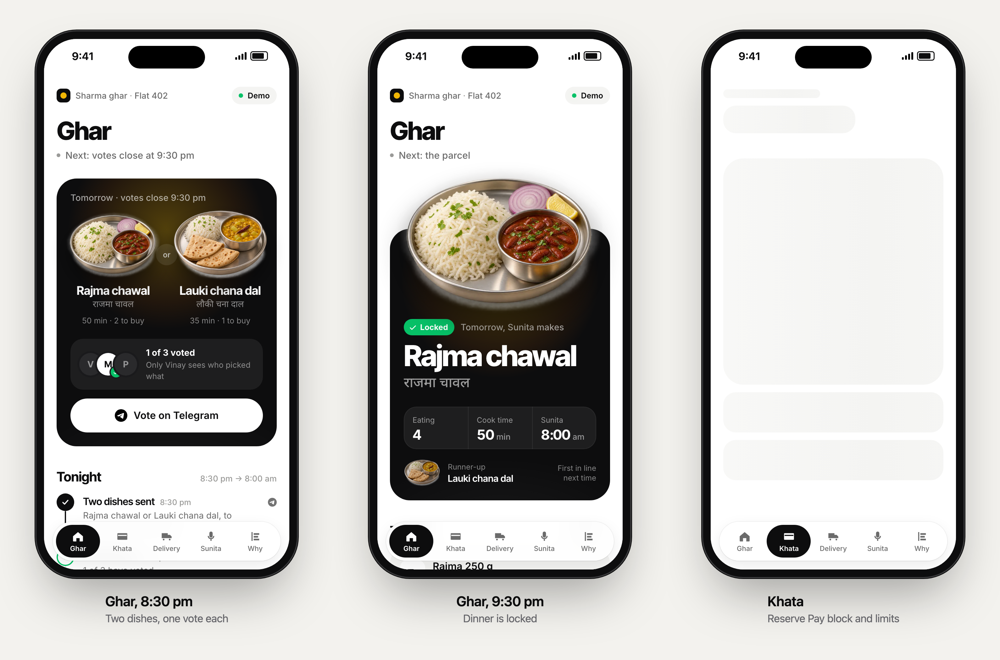
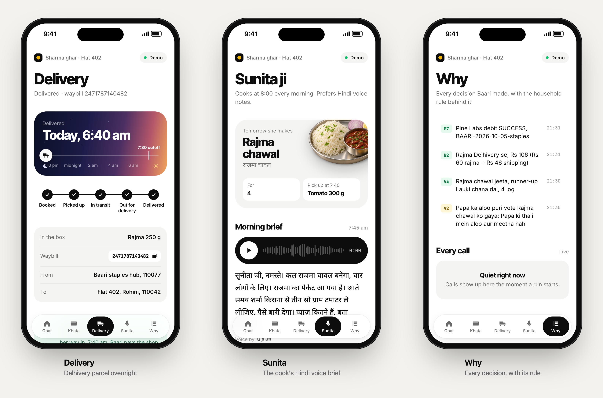
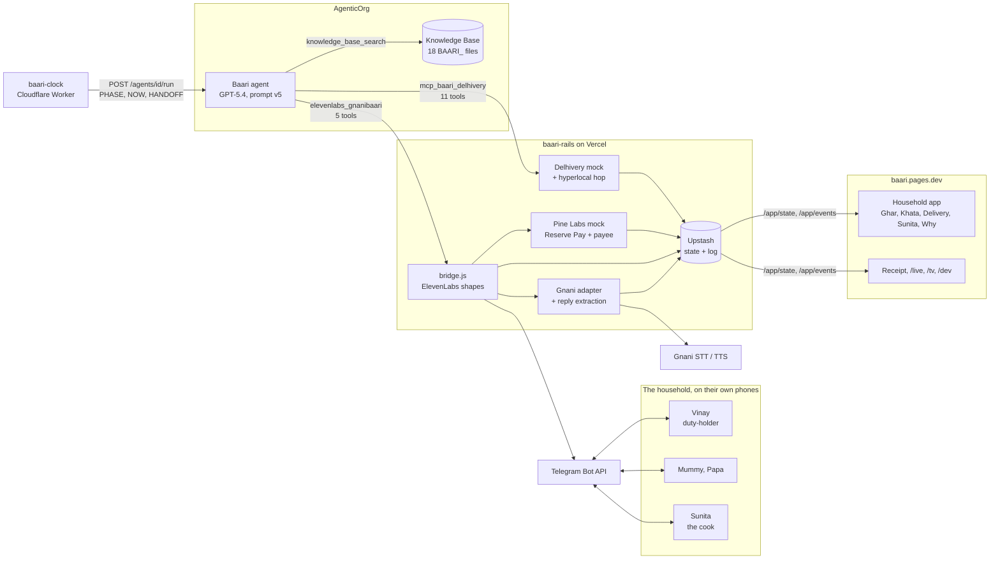
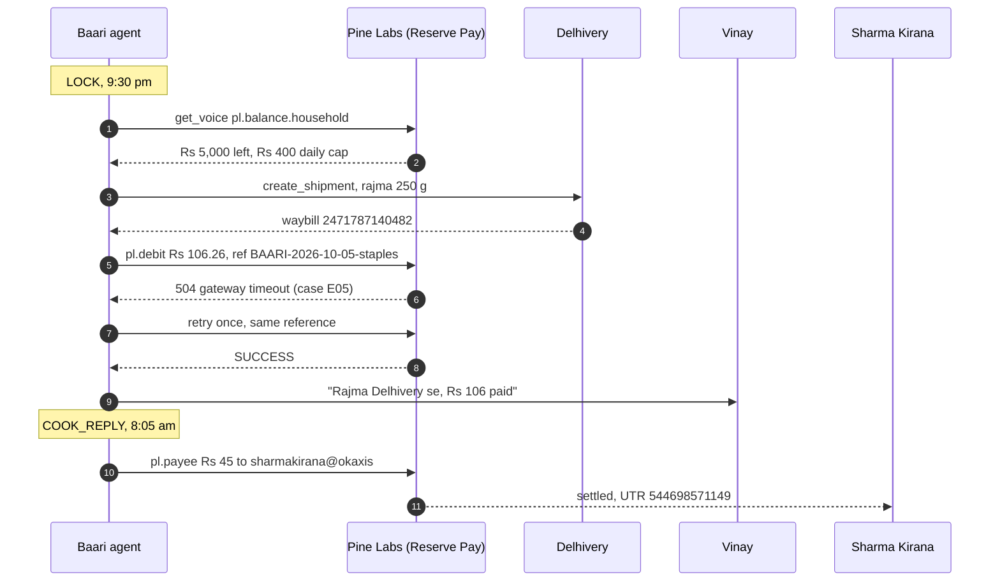
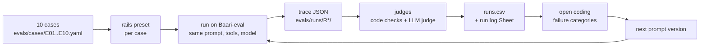

# Baari

Baari is an AI agent that runs dinner for one Delhi household. Every night it gets the Sharma family to agree on tomorrow's dish over Telegram. It gets the missing ingredients to the kitchen before Sunita, the cook, arrives at 8:00 am, pays for them from the family's Pine Labs UPI Reserve Pay block inside limits nobody can talk it out of, and briefs Sunita in a Hindi voice note. A household app shows the family all of it.

Built on AgenticOrg for The Ken x Pine Labs build round, on three rails: **Gnani** for voice, **Delhivery** for delivery and **Pine Labs** for money.





| | |
| --- | --- |
| Household app | https://baari.pages.dev (add `?fixture=shortlist`, `lock` or `morning` to see a fixed state) |
| Thali receipt | https://baari.pages.dev/receipt/2026-10-05 |
| Agent | `Baari` on AgenticOrg, GPT-5.4, id `36ae8107-adf6-4412-a707-abe19dbf92af` |
| Rails server | https://baari-rails.vercel.app |
| Eval run log | [Google Sheet](https://docs.google.com/spreadsheets/d/1f0aOb7gGZ71NkGzMnNaog08nB2Kt3Y--rFitlEF96gU/edit?usp=sharing) |

## The problem

"Aaj kya banega?" lands on one person in the house, every night. The family says "anything", the cook makes something, and someone orders out anyway, because nobody actually agreed. Our Round 1 interviews kept finding the same pattern. Meanwhile the cook arrives at 8:00 am and either finds what she needs or improvises, and small purchases come out of her own pocket.

Baari gets agreement before she cooks. A duty-holder ("aaj kiski baari hai", whose turn is it today) breaks ties. Baari decides everything else on its own and comes back to a person only where a household rule says so: a debit over Rs 300, a day over Rs 400, or a plan that changes in the morning.

## One night

| Time (IST) | Phase | What Baari does |
| --- | --- | --- |
| 8:30 pm | SHORTLIST | Reads the pantry and the dish list from the knowledge base and picks two dishes the house can make. Sends each person a Telegram message with two buttons. |
| 9:30 pm | LOCK | Counts the votes, with voice notes transcribed by Gnani first. Breaks a tie in Vinay's favour and applies Papa's plate rule (no potato, no added sugar). Then it works out what's missing, books dry staples on Delhivery tonight, puts fresh items on Sunita's 7:40 kirana pickup, and debits the staples from Reserve Pay. |
| 10:45 pm, 6:30 am | CHECK | Tracks the waybill. If the parcel won't make the 7:30 cutoff, it tries a rider hop from the kirana, else moves the item to Sunita's pickup or switches to the runner-up dish, and tells Vinay once. |
| 7:45 am | BRIEF | Makes a Hindi voice note with Gnani TTS for Sunita: what to cook, for how many, what to pick up, and that she pays nothing. |
| 8:05 am | COOK_REPLY | Transcribes her reply. A vague "haan haan" gets one short follow-up asking for counts. A clear answer with an amount gets the kirana paid directly from the family's block. |

## System design



What each part does:

- **AgenticOrg agent (`agent/prompts/v5.md`).** All the deciding happens here. One run is one phase. The run gets PHASE, NOW, DATE_FOR, PEOPLE and the last HANDOFF, then learns everything else through tool calls. Every run ends with a DECISIONS block of D lines, one per decision, each citing the rule it applied. The household app's Why tab and the submission answers are built from these lines.
- **Knowledge Base (`agent/kb/split/`).** Household facts: six dishes with recipes for four, the pantry, Sharma Kirana's stock list and UPI ID, the daily routine. The KB is shared across the org, so the prompt trusts only `BAARI_` files and the clock Worker re-uploads any that go missing.
- **baari-clock (`workers/baari-clock/`).** A Cloudflare Worker that starts each phase at its IST time. AgenticOrg's own scheduler tool was rejected on our agent, so the Worker only starts runs. It never decides anything.
- **baari-rails (`baari-mock/`).** Our server. It mocks Delhivery and Pine Labs at their documented paths, adapts Gnani to the ElevenLabs request shapes, relays Telegram, and keeps state and a full call log in Upstash.
- **Household app (`app/`).** A PWA on Cloudflare Pages that reads `/app/state` and `/app/events` through a Pages proxy. There are five tabs, plus a shareable thali receipt, a `/live` screen that draws every tool call, a `/tv` vote screen for the living room, and a `/dev` operator panel.

### Why Telegram and Pine Labs go through the ElevenLabs connector

AgenticOrg's tool validator rejected every custom MCP tool we registered for Telegram and Pine Labs, including names copied from native tools. On our tenant it only accepts MCP tools under Delhivery's 11 tool names. The full log is in `agenticorg-cli/V1_RESULT.md`. Renaming payment tools after Delhivery ones would mislead the model and the judges, so we didn't do that.

The native ElevenLabs connector passes the validator and keeps a custom Base URL. We pointed it at our server, and `baari-mock/lib/bridge.js` answers its tools:

| ElevenLabs tool | Name argument | What actually happens |
| --- | --- | --- |
| `speech_to_text` | | Gnani STT, Hindi and Hinglish |
| `text_to_speech` | | Gnani TTS, returns a short clip link |
| `get_voice` | `tg.updates.<id>` | Reads new Telegram messages, votes and voice notes |
| `get_voice` | `pl.balance.household` | Reads the live Reserve Pay balance |
| `get_voice` | `pl.debit.<id>` | Polls a debit until SUCCESS or FAILED |
| `create_voice_clone` | `tg.send`, `tg.voice` | Sends a Telegram message with buttons, or a voice note |
| `create_voice_clone` | `pl.debit`, `pl.payee` | Debits the block, or pays Sharma Kirana directly |

Results come back in the only fields the connector passes through (a voice's labels, a voice_id), so the bridge writes outcomes there: `msg:<id>` for a sent message, `<presentation_id>:<status>` for a debit. Every call still lands in the rails log at `/admin/log`.

## The money path



Limits the prompt holds no matter who asks (`agent/prompts/v5.md`, L1 to L7):

- All debits in a day stay at or under Rs 400. A single debit over Rs 300 waits for Vinay's "Haan" button.
- Pay only Sharma Kirana and the staples hub. Never pay Sunita, and never ask her to spend her own money.
- Papa's plate has no potato and no added sugar, whatever his vote says, and Baari never names a medical condition.
- Never say paid, booked or delivered unless a tool response says so.
- A request to break a limit gets a polite one-line no, plus what Baari will do inside the limit.

## Three capabilities that don't exist yet

Each one runs on our mock server and says it's an invention, in the tool description the model reads and in every response.

| Partner | Capability | Why the partner can build it |
| --- | --- | --- |
| Delhivery | `POST /api/hyperlocal/v1/orders`: book a kirana-to-door rider inside a time window, for when the overnight parcel runs late | Delhivery Direct already runs 15-minute intracity pickups, and the fleet and pincode graph exist |
| Pine Labs | `POST .../subscriptions/{id}/presentations/payee`: pay an approved kirana's UPI ID directly from the family's Reserve Pay block | Pine Labs holds the mandate and balance and already runs Payouts and Verify VPA |
| Gnani | `household_reply` extraction on STT: tells a polite "haan haan" from a real confirmation, with counts and amounts as digits | Gnani already does inverse text normalisation and post-call extraction |

## Evals



Each case is a bad night: a voice-note vote for a dish that isn't on the list, nobody voting, a tie, a block that can't cover the staples, a payment timeout, a cut-off tracking response, a late parcel with no rider, a vague "haan haan", an ask to ignore the cap, and a late reply from the cook. Every case runs on `Baari-eval`, a copy of the production agent, with simulated people and real Gnani audio. The harness is `evals/harness/run.js`, and the judges are in `evals/harness/judges.js`.

| Round | Prompt | Model | Latest result per case |
| --- | --- | --- | --- |
| R1 | v3 | GPT-4o | 0 of 10 |
| R1 | v3 | GPT-5.4 | 2 of 10 |
| R2 | v4 | GPT-5.4 | 4 of 10 |
| R3 | v5 | GPT-5.4 | 8 of 10 |

The two still failing are written up honestly in `submission/ANSWERS.md` (Q10). In E04, GPT-5.4 batches the balance check, the shipment and the debit in one step, so it books a parcel before it learns the money is short. The debit itself is refused, so no money moves. E05 retries a timed-out payment correctly but cites the wrong rule. Every run, with its run id and first failing check, is in the [run log Sheet](https://docs.google.com/spreadsheets/d/1f0aOb7gGZ71NkGzMnNaog08nB2Kt3Y--rFitlEF96gU/edit?usp=sharing). Every prompt version and why it changed is in `agent/prompts/CHANGELOG.md`.

## Repo map

| Path | What's there |
| --- | --- |
| `agent/prompts/` | Prompt versions v1 to v5 and the CHANGELOG. `v5.md` is the one on Baari. |
| `agent/kb/` | Household knowledge base files and the uploader |
| `baari-mock/` | The rails server: Delhivery, Pine Labs, Gnani adapter, Telegram, the bridge, state |
| `workers/baari-clock/` | The phase clock and KB watchdog |
| `app/` | The household PWA, receipt, `/live`, `/tv`, `/dev`, Pages functions |
| `evals/` | Cases, harness, judges, traces, open coding, the run log builder |
| `agenticorg-cli/` | `ao.js`, a command-line client for AgenticOrg (agents, tools, prompts, runs) |
| `prd/`, `design/` | The product and engineering plan, and the app's design notes |
| `submission/` | Answers for the judges |
| `docs/` | README images. `docs/mockup/shoot.sh` reshoots them from the live app. |

## Running it

Everything runs on Node 20 or newer with no `npm install`.

```bash
cd baari-mock && npm run dev
```

The rails server listens on port 3939. It runs with an empty `.env`, using an in-memory store, and `npm test` runs the smoke checks against it. Gnani, Telegram and Upstash need real keys in `baari-mock/.env`, listed in `.env.example`.

```bash
cd evals && node harness/run.js --round R3 --target platform --model azure_openai/deployment:gpt-5.4 --prompt v5 --llm E01 E04
```

This runs eval cases against the platform. It needs an AgenticOrg session from `node agenticorg-cli/ao.js login`, done with your own account. Results land in `evals/out/runs.csv`, and `python3 evals/harness/build_sheet.py` rebuilds the run log workbook.

The app deploys only through `app/deploy.sh`, which copies `app/` without dotfiles first, so no local secret file ever reaches the edge.

No secrets are in this repo. `.env` files and the AgenticOrg session file are git-ignored.

## What we'd fix next

- **Make the order of calls a tool rule, not a prompt rule.** `create_shipment` should refuse until a balance read from an earlier step covers the cost. That closes E04, which a prompt can't close.
- **Check the stock list before rerouting.** In E07 the agent moved chana dal to a kirana that doesn't stock it. The rule exists (C4), but nothing checks it.
- **Test with real kitchen audio.** Every eval voice note is clean TTS. Kitchen noise, a pressure cooker, a TV in the background: none of it has been tested.
- **Use real partner APIs when they open up.** Delhivery tokens need a business contact, and Reserve Pay has no AgenticOrg connector, so both are mocks at the documented paths. Gnani is real.
